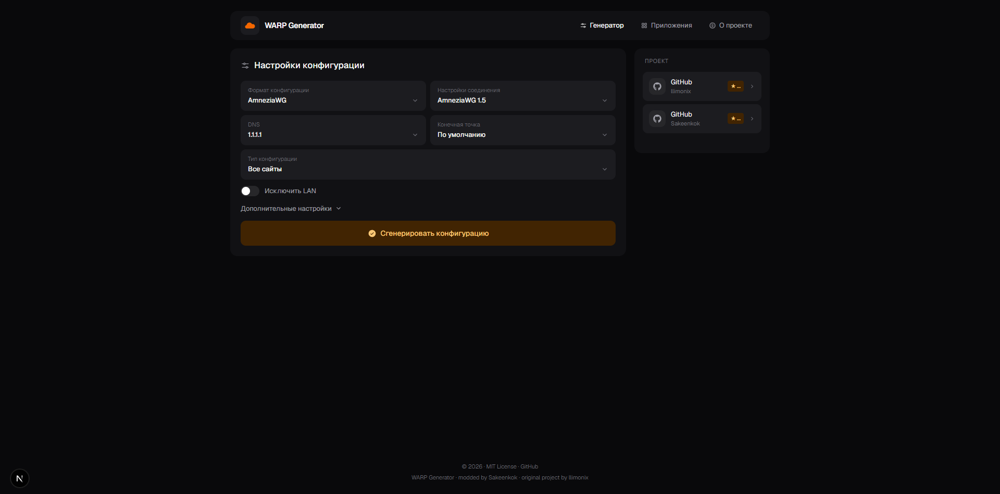
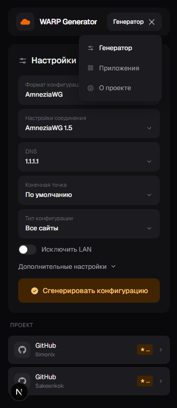

# WARP Configuration Generator

**Русский** | [English](README.md)

### Оригинальная версия от llimonix


*Оригинальный интерфейс проекта llimonix / nellimonix.*

### Текущая версия форка — Sakeenkok & Dariysu

#### Desktop



*Актуальная версия форка с изменениями интерфейса, брендинга и адаптивности.*

#### Mobile



*Актуальная мобильная версия форка — Sakeenkok & Dariysu.*

Открытый генератор конфигов Cloudflare WARP (WireGuard / AmneziaWG / Clash / Throne / Nekoray / Husi / Karing / WireSock).

Это **публичная** версия — без капчи, без аналитики, без промо-блоков. Self-host friendly.

## 🌐 Версия Sakeenkok & Dariysu

Этот форк основан на оригинальном проекте **nellimonix/warp-config-generator-vercel** и содержит собственные изменения интерфейса, брендинга и адаптивности.

- **Основной сайт:** [https://warp.sakeen.ru](https://warp.sakeen.ru)
- **Cloudflare-зеркало:** [https://warp-generator.sadafaxdid.workers.dev](https://warp-generator.sadafaxdid.workers.dev)
- **Telegram Dariysu:** [https://t.me/dar1ysu](https://t.me/dar1ysu)
- **GitHub:** [https://github.com/Thiefgg/warp-config-generator-vercel](https://github.com/Thiefgg/warp-config-generator-vercel)

## 🚀 Быстрое развертывание

### Docker (рекомендуется)

Готовый образ публикуется в GHCR при каждом пуше в `master`:

```bash
docker run -d --name warp-generator \
  -p 3000:3000 \
  --restart unless-stopped \
  ghcr.io/nellimonix/warp-config-generator-vercel-public:latest
````

Откройте [http://localhost:3000](http://localhost:3000).

### Docker — сборка локально

```bash
docker build -t warp-generator-public .
docker run -d -p 3000:3000 --name warp-generator warp-generator-public
```

### docker-compose

```yaml
services:
  warp-generator:
    image: ghcr.io/nellimonix/warp-config-generator-vercel-public:latest
    container_name: warp-generator
    ports:
      - "3000:3000"
    restart: unless-stopped
```

### Vercel

[](https://vercel.com/new/clone?repository-url=https://github.com/Thiefgg/warp-config-generator-vercel&repository-name=warp)

* Или через [CLI](https://vercel.com/docs/cli): `vercel deploy`
* Локально: `vercel dev`

### Netlify

[](https://app.netlify.com/start/deploy?repository=https://github.com/Thiefgg/warp-config-generator-vercel&siteName=warp)

* Или через [CLI](https://docs.netlify.com/cli/get-started/): `netlify deploy`
* Локально: `netlify dev`

### Cloudflare Workers

[](https://deploy.workers.cloudflare.com/?url=https://github.com/Thiefgg/warp-config-generator-vercel)

* Или через [Wrangler](https://developers.cloudflare.com/workers/wrangler/): `wrangler deploy`
* Локально: `wrangler dev`

### Cloudflare Pages

Тот же `wrangler.jsonc` подходит для Pages со static export.

```bash
CLOUDFLARE_WORKERS=1 npm run build
npx wrangler pages deploy out --project-name=warp-generator
```

Либо подключите репозиторий в Cloudflare dashboard:

* Build command: `CLOUDFLARE_WORKERS=1 npm run build`
* Output directory: `out`

## 🛠️ Локальная разработка

```bash
npm install
npm run dev
npm run build
npm run start
npm run lint
```

* `npm run dev` — запуск dev-сервера на `:3000`
* `npm run build` — production-сборка
* `npm run start` — запуск production-сборки
* `npm run lint` — проверка кода

## ⚙️ Настройки генератора и API

Одинаковые параметры доступны в интерфейсе и в `POST /api/generate`:

| Параметр            | Поведение и ограничения                                                                                                                                                                                                                                                                                                     |
| ------------------- | --------------------------------------------------------------------------------------------------------------------------------------------------------------------------------------------------------------------------------------------------------------------------------------------------------------------------- |
| Конечная точка      | `endpointRandom: true` выбирает новый адрес и порт Cloudflare при каждой генерации. Для MASQUE используется отдельный пул адресов и портов.                                                                                                                                                                                 |
| Протокол Clash      | `clashProtocol` принимает `awg`, `masque` или `awg_masque`. Комбинированный режим добавляет в конфиг переключаемые прокси AWG, MASQUE QUIC и MASQUE H2.                                                                                                                                                                     |
| DNS                 | Провайдеры задаются в `config/dns.ts`. Общественные провайдеры отмечены символом `•`; при их выборе включается режим **Все сайты**, а выбранные сервисы сбрасываются, поскольку split tunneling не поддерживается. Неизвестный ID провайдера заменяется на Cloudflare DNS.                                                  |
| IPv6                | Включён по умолчанию. Отключение убирает IPv6 из адреса интерфейса, списка DNS и стандартного `AllowedIPs` для всех сайтов.                                                                                                                                                                                                 |
| Исключить LAN       | Доступно только в режиме **Все сайты**. Стандартные маршруты заменяются диапазонами публичных адресов, поэтому приватные и зарезервированные LAN-диапазоны остаются вне туннеля.                                                                                                                                            |
| PersistentKeepalive | По умолчанию отключён. При включении с пустым полем интерфейс использует `25`; API принимает целые числа от `1` до `65535` и не добавляет некорректные значения. Параметр выводится в конфиги WireGuard и WireSock.                                                                                                         |
| Собственный I1      | Непустое значение очищается от пробелов по краям; его длина не должна превышать 253 символа, а внутри не должно быть пробелов. AmneziaWG WireGuard генерирует по нему QUIC-маску `I1`, а WireSock использует его как `Id`. При пустом или некорректном значении без ошибки выбирается встроенная случайная маска или домен. |

### Пример запроса

```bash
curl -X POST http://localhost:3000/api/generate \
  -H 'Content-Type: application/json' \
  -d '{
    "selectedServices": [],
    "siteMode": "all",
    "deviceType": "awg15",
    "endpoint": "engage.cloudflareclient.com:4500",
    "configFormat": "wireguard",
    "dnsId": "cf",
    "ipv6": false,
    "excludeLan": true,
    "persistentKeepalive": 25,
    "customI1Domain": "google.com"
  }'
```

Успешный ответ содержит `success: true` и объект `content` с полями `configBase64`, `qrCodeBase64`, `configFormat` и `fileName`.

Поле `configBase64` содержит конфигурацию в Base64, а `qrCodeBase64` — data URL изображения.

## ➕ Добавить новый сервис

Режим «выбранные сайты» позволяет роутить через WARP только определённые сервисы.

Чтобы добавить свой:

1. **Форкните** репозиторий и создайте ветку, например `feat/service-newsite`.
2. **Создайте** `config/services/<ключ-сервиса>.json`:

```json
{
  "name": "Название сервиса",
  "icon": "FaIconName",
  "iconLibrary": "fa",
  "type": "new",
  "ips": "1.2.3.0/24, 5.6.7.0/24, ..."
}
```

* `name` — видимое пользователю название.
* `icon` — имя иконки из [react-icons](https://react-icons.github.io/react-icons/). Проверьте, что такая иконка есть в выбранной библиотеке.
* `iconLibrary` — одно из: `fa`, `fa6`, `si`, `bi`, `md`, `ri` и т.д.
* `type` — опционально. Поставьте `"new"`, чтобы показать бейдж «NEW».
* `ips` — CIDR-диапазоны через запятую.

3. **НЕ редактируйте** `worker/api-handler.js` и `functions/api/generate.js`. GitHub Action автоматически перегенерирует блок `IP_RANGES` после мерджа в `master`.
4. **Откройте Pull Request** в `master`.

### Локальная проверка ребилда

```bash
node scripts/build-ip-ranges.mjs
```

Скрипт читает `config/services/*.json` и переписывает блок `// IP_RANGES:BEGIN ... // IP_RANGES:END` в обоих файлах worker/functions.

### Добавить DNS-провайдера

1. Добавьте провайдера в `DNS_PROVIDERS` в `config/dns.ts`.
2. Укажите `isCommunity: true`, если провайдер несовместим с маршрутизацией выбранных сайтов.
3. Продублируйте запись во встроенных массивах `DNS_PROVIDERS` в `worker/api-handler.js` и `functions/api/generate.js`.
4. Перед открытием PR запустите:

```bash
npm run build
```

Docker и Vercel используют `config/dns.ts` напрямую, а Cloudflare Workers и Netlify выполняют встроенные обработчики.

### Обновление стандартных I1-масок

`lib/builders/shared.ts` — источник масок, которые используются, если собственный I1-домен не задан.

1. Редактируйте массив `I1_MASKS` между маркерами `// I1_MASKS:BEGIN` и `// I1_MASKS:END`.
2. Запустите:

```bash
node scripts/build-i1-masks.mjs
```

3. Закоммитьте с исходным изменением сгенерированные правки в `worker/api-handler.js` и `functions/api/generate.js`.

## 📁 Структура проекта

```text
├── app/
│   ├── layout.tsx                 Корневой layout
│   ├── page.tsx                   Серверный компонент — загрузка сервисов
│   ├── not-found.tsx              Страница 404
│   └── api/generate/route.ts      POST endpoint — генерация конфигов
│
├── components/
│   ├── home-client.tsx            Клиентская оболочка — табы и состояние
│   ├── layout/
│   │   ├── topbar.tsx             Логотип и навигация
│   │   ├── sidebar.tsx            GitHub и список серверов
│   │   └── footer.tsx
│   ├── generator/
│   │   ├── config-selectors.tsx
│   │   ├── advanced-settings.tsx
│   │   ├── service-picker.tsx
│   │   ├── result-panel.tsx
│   │   ├── formats-tab.tsx
│   │   └── about-tab.tsx
│   └── icons/
│
├── config/
│   ├── services/                  JSON-файлы сервисов
│   ├── services-loader.ts         Автозагрузка сервисов
│   ├── dns.ts                     DNS-провайдеры
│   ├── endpoints.ts               Endpoint-ы Cloudflare WARP
│   └── formats.ts                 Форматы конфигов
│
├── lib/
│   ├── builders/
│   │   ├── wireguard.ts
│   │   ├── throne.ts
│   │   ├── clash.ts
│   │   ├── nekoray.ts
│   │   ├── husi.ts
│   │   ├── karing.ts
│   │   ├── wiresock.ts
│   │   ├── shared.ts
│   │   └── index.ts
│   ├── warp-service.ts
│   ├── quic.ts
│   ├── cloudflare-client.ts
│   ├── crypto.ts
│   ├── qr-generator.ts
│   └── ip-ranges.ts
│
├── hooks/
│   ├── use-generator.ts
│   └── use-mobile.ts
│
├── scripts/
│   ├── build-ip-ranges.mjs
│   └── build-i1-masks.mjs
│
├── worker/
├── functions/
├── types/
├── styles/globals.css
├── .github/workflows/
├── Dockerfile
├── next.config.mjs
└── package.json
```

## 🔧 Конфигурация

Публичная сборка не требует переменных окружения.

Генератор работает анонимно через публичный Cloudflare WARP API регистрации.

### Режимы сборки

`next.config.mjs` переключает `output` по переменным окружения:

| Переменная                        | Output       | Где используется                      |
| --------------------------------- | ------------ | ------------------------------------- |
| `DOCKER_BUILD=1`                  | `standalone` | Docker / Dokploy                      |
| `CLOUDFLARE_WORKERS` / `CF_PAGES` | `export`     | Cloudflare Workers / Cloudflare Pages |
| *нет*                             | по умолчанию | Vercel / Netlify                      |

## 🌐 Поддерживаемые платформы

| Платформа          | Поддержка | Заметки                   |
| ------------------ | --------- | ------------------------- |
| Docker (self-host) | ✅ Полная  | Standalone-сервер Next.js |
| Vercel             | ✅ Полная  | Default runtime           |
| Netlify            | ✅ Полная  | Edge functions            |
| Cloudflare Workers | ✅ Полная  | Static export + worker    |
| Cloudflare Pages   | ✅ Полная  | Static export             |

## 📄 Лицензия

MIT License — см. [LICENCE](LICENCE).

Этот форк сохраняет лицензию и атрибуцию оригинального проекта.

## 🤝 Вклад в развитие

Вклад в развитие проекта приветствуется.

1. Форкните репозиторий.
2. Создайте отдельную ветку.
3. Внесите изменения.
4. Проверьте проект локально.
5. Создайте Pull Request.

## 🔗 Ссылки

### Sakeenkok & Dariysu

* **Main Site:** [https://warp.sakeen.ru](https://warp.sakeen.ru)
* **Cloudflare Mirror:** [https://warp-generator.sadafaxdid.workers.dev](https://warp-generator.sadafaxdid.workers.dev)
* **GitHub:** [https://github.com/Thiefgg/warp-config-generator-vercel](https://github.com/Thiefgg/warp-config-generator-vercel)
* **Telegram:** [https://t.me/dar1ysu](https://t.me/dar1ysu)

### Оригинальный проект llimonix

* **Main Site:** [https://warp3.llimonix.pw](https://warp3.llimonix.pw)
* **Vercel Mirror:** [https://warply3.vercel.app](https://warply3.vercel.app)
* **Netlify Mirror:** [https://getwarp3.netlify.app](https://getwarp3.netlify.app)
* **Cloudflare Mirror:** [https://warp.llimonix.workers.dev](https://warp.llimonix.workers.dev)
* **GitHub:** [https://github.com/nellimonix/warp-config-generator-vercel](https://github.com/nellimonix/warp-config-generator-vercel)

## ⭐ Star History

[](https://www.star-history.com/?repos=Thiefgg%2Fwarp-config-generator-vercel&type=date&legend=bottom-right)

